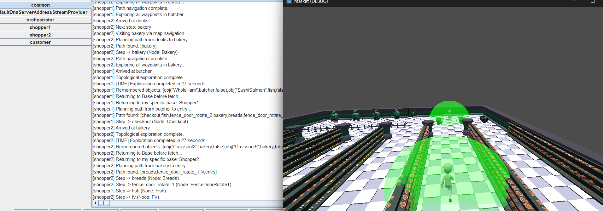

# VEsNA-Market

VEsNA-Market is a **multi-agent supermarket shopping** playground built on top of the [VEsNA](https://github.com/VEsNA-ToolKit/vesna-light) framework. It demonstrates how multiple JaCaMo agents can coordinate inside a Godot 4 virtual supermarket to explore aisles, build shared object memory, and fulfil shopping list orders in parallel.

> [!NOTE]
>
> For documentation on the **VEsNA framework** itself (internal actions, CArtAgO artifacts, WebSocket protocol, agent body setup), refer to the [VEsNA repository](https://github.com/VEsNA-ToolKit/vesna-light).



## Quick Start

1. **Clone the repository:**
   ```bash
   git clone https://github.com/HarpritSingh-7187/vesna-market.git
   cd vesna-market
   ```
2. **Open the Godot project:** launch [Godot 4](https://godotengine.org/download/) and import the Market project from `env/market/`. Press **Play** to start the scene.
3. **Run the agents:** in a separate terminal, navigate to `mind/` and run:
   ```bash
   gradle run
   ```
4. The agents will connect to the Godot bodies via WebSocket and begin acting in the environment.

> [!TIP]
>
> Always start Godot **before** Gradle. The agents try to open a WebSocket connection on startup; if the Godot scene is not running yet, the connection will fail.

## Requirements

- Java 23 (if you change version, update `build.gradle`);
- Gradle (tested with version 8+);
- Godot 4.

Java dependencies (JaCaMo 1.2, Java-WebSocket, JSON) are managed automatically by Gradle.

---

## Market Playground

### Multi-Agent Architecture

The Market playground is composed of **4 agents** with distinct roles:

| Agent | Type | Godot Body | Role |
|---|---|---|---|
| **Orchestrator** | Logic agent | ❌ No | Central coordinator: assigns exploration zones, dispatches shopping orders to idle shoppers |
| **Shopper1** | Embodied agent | ✅ Port 9080 | Explores assigned zones, builds object memory, fetches items on demand |
| **Shopper2** | Embodied agent | ✅ Port 9081 | Same as Shopper1, operates in parallel on different zones |
| **Customer** | Logic agent | ❌ No | Simulates external shopping list orders arriving at timed intervals |

### Operational Flow

The system operates in **three sequential phases**:

#### Phase 1 — Registration

1. The Shoppers start and register themselves with the Orchestrator via `.send(orchestrator, tell, available(Me))`.
2. The Orchestrator waits for registrations, then assigns **exploration zones** to each Shopper.

#### Phase 2 — Parallel Exploration

1. Each Shopper receives a list of regions to explore (e.g., Shopper1 → `[fv, breads, drinks, bakery]`, Shopper2 → `[dairy, fish, sauces, butcher]`).
2. The Shopper navigates to each region via map-based pathfinding, then performs a **full waypoint traversal** (`vesna.walk(region)`) to visually scan all products.
3. When an object is perceived (`perception(object_state, ...)`), it is stored in local memory and **broadcast** to all other shoppers, building a shared knowledge base.
4. Once all assigned zones are explored, each Shopper returns to its base and notifies the Orchestrator.

#### Phase 3 — Order Fulfillment

1. The Customer sends shopping list orders to the Orchestrator (e.g., `["Watermelon", "Cheese3", "Ketchup", ...]`).
2. The Orchestrator **dispatches items round-robin** across idle Shoppers.
3. Each Shopper looks up the item in its shared memory, **navigates to the correct region**, walks to the object, and **grabs** it.
4. After completing all assigned tasks, the Shopper returns to base and reports completion.
5. When all Shoppers are idle, the Orchestrator checks for pending (queued) orders.


### Supermarket Map

The Market environment is modeled as an **RCC (Region Connection Calculus)** topological map with **11 regions** organized in **3 sections**, connected by gate nodes:


**RCC relations used:**

| Relation | Meaning | Example |
|---|---|---|
| `ec` (Externally Connected) | Physical adjacency — agents can walk between these regions | `ec(entry, fv)` |
| `ntpp` (Non-Tangential Proper Part) | Region contained in a section | `ntpp(dairy, section2)` |
| `po` (Partial Overlap) | Gate connecting two sections | `po(fence_door_1, section2)` |

All relations are declared with symmetric closure rules in `market_map.asl`.

### Exploration Zones

The Orchestrator splits the 8 shoppable regions into **zones** for parallel exploration:

| Zone | Regions | Assigned to |
|---|---|---|
| Zone 1 | `fv`, `breads`, `drinks`, `bakery` | Shopper1 |
| Zone 2 | `dairy`, `fish`, `sauces`, `butcher` | Shopper2 |

> [!TIP]
>
> For **single-agent** mode, comment out Zone 2 in `orchestrator.asl` and assign all 8 regions to Zone 1. Also adjust the Customer wait time in `customer.asl` (see the commented lines).

### Perception & Shared Memory

When a Shopper visually perceives an object during exploration, it:

1. Stores it locally as `object(Name, Region, Grabbable)`;
2. **Broadcasts** it to all other agents via `.broadcast(tell, object(...))`.

This creates a **shared distributed memory** — when the Order Fulfillment phase begins, every Shopper knows where every product is, regardless of who originally discovered it.

### Shopping List Orders

The **Customer** agent sends timed orders to the Orchestrator:

| Order | Delay | Items |
|---|---|---|
| 1st | 5 seconds after start | `Watermelon`, `Cheese3`, `Ketchup`, `Musterd`, `Croissant`, `MeatPatty` |
| 2nd | 60 seconds after 1st | `SodaBottle`, `Loaf`, `Apple`, `CakeBirthday` |

Orders are queued if exploration is not yet complete or all agents are busy.

### Timing & Metrics

The system logs timing data automatically:

- **Exploration duration**: per-agent time to complete zone exploration
- **Fetch duration**: per-item time from order receipt to grab
- **Order fulfillment duration**: total time to fulfil an entire shopping list

---

## Project Structure

```
vesna-market/
├── mind/                                   # JaCaMo agent-side
│   ├── build.gradle                        # Gradle build (Java 23, JaCaMo 1.2)
│   ├── market.jcm                          # Market MAS configuration
│   └── src/agt/
│       ├── vesna.asl                       # Core VEsNA plans (see vesna-light)
│       ├── vesna/                          # VEsNA internal actions (see vesna-light)
│       └── playgrounds/market/
│           ├── orchestrator.asl            # Orchestrator agent
│           ├── shopper.asl                 # Shopper agent (shared by shopper1 & shopper2)
│           ├── customer.asl                # Customer agent (order sender)
│           └── market_map.asl              # RCC topological map of the supermarket
└── env/market/                             # Godot 4 Market project (body-side)
```

## Configuration — `market.jcm`

```prolog
mas market {

    // Orchestrator: Logic agent, central coordinator
    agent orchestrator:playgrounds/market/orchestrator.asl {
        beliefs: address("localhost")
                 port(9082) // Fake port (no Godot body)
    }

    // Shopper 1: Embodied agent
    agent shopper1:playgrounds/market/shopper.asl {
        beliefs:    address( localhost )
                    port(9080) 
        goals:      start
        ag-class:   vesna.VesnaAgent
    }

    // Shopper 2: Embodied agent
    agent shopper2:playgrounds/market/shopper.asl {
        beliefs:    address( localhost )
                    port(9081) 
        goals:      start
        ag-class:   vesna.VesnaAgent
    }

    // Customer: External agent (no Godot body)
    agent customer:playgrounds/market/customer.asl {
    }
}
```


## Running the Market Playground

> [!IMPORTANT]
>
> Make sure you have all the [requirements](#requirements) installed before proceeding.

1. **Start the Godot scene first.** Open Godot 4, import the Market project from `env/market/`, and press **Play** (or `F5`). The WebSocket servers will begin listening for agent connections.
2. **Then start the agents.** Open a terminal in the `mind/` folder and run:
   ```bash
   gradle run
   ```
3. The agents will automatically connect to their Godot bodies and start executing their plans.